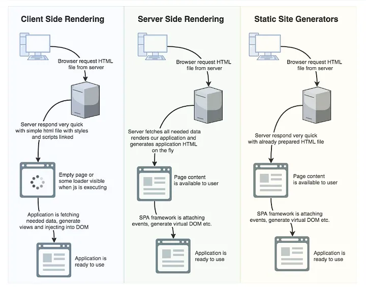

---
title: 'What is FabRiBau?'
description: 'First post to explain what this site is, why it was built this way, and the technical decisions behind Astro + Cloudflare Pages.'
pubDate: 2026-09-09
tags: ['Astro', 'Cloudflare Pages', 'SSG', 'Neobrutalismo', 'Portfolio']
---

Hey, dear reader. First of all, thanks for being here — and especially for taking the time to read something I wrote. This is the first post on the site, so I'll try to explain what this is, why it exists, and some of the technical decisions I made while building it.

---

## What is FabRiBau?

If we had to Wikipedia-define it, it comes from the acronym of **Fab**rizio **Ri**era **Bau**er, and it's meant to be my personal and professional brand as a developer. It's the same name I use on GitHub, and this site plays the role of a **portfolio**: a place where I'll gradually post the most interesting projects I work on, and where I might also share some of the things I built during university.

But beyond being a portfolio, I want it to be a different way of presenting myself. A real alternative to that cold, one-page Harvard-format CV optimized to pass ATS filters without leaving a trace — and to the typical LinkedIn formalities (which sometimes feel a bit stiff). Here there's a bit more context, more judgment, and hopefully, more personality.

I wanted a space of my own where things feel different: somewhere I could show not just the code I write, but the engineering decisions behind each solution, my technical opinions, and a little bit of who I am.

---

## What did I actually build?

I built this site from scratch with [Astro](https://astro.build/), aiming for something fast, lightweight, and easy to maintain. Some of the concrete things I implemented:

- **Minimal JavaScript sent to the client:** thanks to Astro's architecture, pages are served as static HTML. JS only shows up where it's truly needed (the theme toggle, the language picker, the contact form).
- **Bilingual i18n system (ES/EN):** using Astro's native route prefixes and TypeScript-typed dictionaries. Every page has its Spanish and English version without duplicating logic.
- **Contact form with Resend and Cloudflare Turnstile:** the form sends messages via [Resend](https://resend.com/) (transactional) and has anti-bot protection with Turnstile instead of the classic reCAPTCHA (no annoying traffic light or crosswalk captchas for the user to solve).
- **Neobrutalist style:** because after a talk I watched at Platzi Conf I really wanted to build something outside the common denominator of today's sites. Thick borders, hard offset shadows, a vivid palette with a dark variant, and bold typography. Maybe it's not the most elegant style in the world, but it definitely doesn't go unnoticed.

---

## Why Astro? And not NextJS + Vercel?

### SSG vs SSR vs the rest

This is where things get a bit more interesting. I discovered **Astro** back in March and I was immediately drawn to the idea of **SSG** (*Static Site Generation*), where the **HTML** is generated at build time and then served as hyper-optimized flat static files. Before going further, let's do a quick rundown of the alternatives:

- **SSR (Server-Side Rendering):** If you've used Next.js or something similar, you already know this one. The server generates the HTML on every request, the browser displays it right away, and then JavaScript "hydrates" the page by connecting the HTML with the client-side framework. Great for SEO and initial load, but there's the cost of hydration and a server that's always on, computing every request (which introduces infrastructure costs and latency from cold starts in serverless architectures).
- **CSR (Client-Side Rendering):** The classic SPA approach in React, Vite, or Vue. The server sends a minimal HTML (the infamous `

`) plus a hefty JavaScript bundle. The browser downloads it, executes it, and only then renders the UI (the problem? Blank screens with loading *spinners*). Flexible for complex SPAs, but with real impact on First Contentful Paint and SEO if not handled carefully.
- **Classic PHP:** The noble method that built a huge chunk of the web — because yes, it's still a viable option. The server runs PHP code, generates HTML on the fly by combining templates with database data, and delivers it ready to display. Simple and straightforward, with the cost of running server-side logic on every request.
- **Pure static HTML:** The classic of all classics, where it all began. You upload your `.html` and `.css` files and the server delivers them as-is (archaic times, but incredibly important ones). Blazing fast, zero complexity, but very tedious to maintain at scale and with no component reuse whatsoever. Unmanageable for real projects today.

  Figure 1: Comparison of rendering strategies — SSG, SSR and CSR — and how each one serves HTML to the browser.

Looking at the options, Astro with SSG stands out by a mile for content-focused sites. It's no coincidence that its slogan is *"The web framework for content-driven websites"*: portfolios, blogs, e-commerce, landing pages, documentation… all those sites where the focus isn't on complex functionality but on presenting information as well as possible. In these cases, the value is in the content and how fast the user can consume it. Does it make sense to force the browser to download 200 KB of React *runtime* just to read a text article? Clearly not.

In concrete terms: Astro generates pure HTML at build time and serves it from a global CDN. The result is a **Time to First Byte (TTFB) in the single-digit milliseconds** because there's no server running code at runtime — just static files being delivered from the edge node closest to the user. On top of that, the JavaScript bundle sent to the client is minimal by default (the *islands* architecture only hydrates interactive components, not the whole page).

It's not by chance that solutions like **[Starlight](https://astro.build/themes/details/starlight/)** (Astro's documentation template) are growing in popularity — look it up and you'll see it everywhere.

Companies like Google, Microsoft, OpenAI, and Cloudflare itself use it. Speaking of Cloudflare…

---

## Deploying on Cloudflare Pages

In other projects I always deployed on Vercel, mainly because I was building things in Next.js and the integration between the two is excellent (makes sense — Vercel created Next.js). Honestly, the platform works great, it integrates perfectly with the ecosystem, and — why deny it — the fact that their CEO (Guillermo Rauch) is Argentine always added an extra dose of goodwill (random fact nobody asked for: I was once on a video call with him and a few fellow students from university).

When I switched frameworks, I decided to explore alternatives.

**Cloudflare Pages** is Cloudflare's deployment platform for static sites and serverless applications. It runs on the same network that handles more than **20% of global Internet traffic** and has over **300 points of presence (PoPs)** distributed worldwide, which means your static files are served from the node closest to the user with no extra configuration needed. For an SSG site like this one, that translates directly into ultra-low latency (whether someone visits from San Luis, Madrid, or Tokyo, the data is served from the nearest physical server with minimal TTFB — we're talking a few milliseconds).

Some concrete advantages over Vercel for this use case:

- **Unlimited bandwidth on the free plan:** Vercel has request and bandwidth limits on its free tier that can become a problem if traffic scales. Cloudflare Pages doesn't have those for static sites.
- **Native integration with the Cloudflare ecosystem:** Workers, KV, R2, D1, Turnstile… If the site ever needs more server-side functionality, the migration path is natural. In fact, I'm already using Turnstile for the contact form.
- **Better story for SSG sites:** Vercel has a lot of optimizations built specifically for Next.js (ISR, Edge Middleware, etc.) that simply don't apply to a fully static site. For Astro SSG, Cloudflare Pages is the more direct choice.

Also, earlier this year Cloudflare acquired Astro (the amount wasn't disclosed), so in the medium term there will probably be additional optimizations or integrations between the two platforms. It's not the only reason to go with it, but it's not a small detail either.

---

## Final thoughts

What's interesting about all of this is maybe not staying in the comfort zone and adding new tools to the toolbox. As one of my professors used to say, *Always learn something new, because knowledge takes up no space*. Sometimes it's worth stepping off autopilot and asking yourself what the truly right tool is for each problem — I think there's a lot of value in that, especially today with artificial intelligence that can write code for us.

Thanks for reading! If any of this caught your interest, the [contact](/en/contact) section is always open.