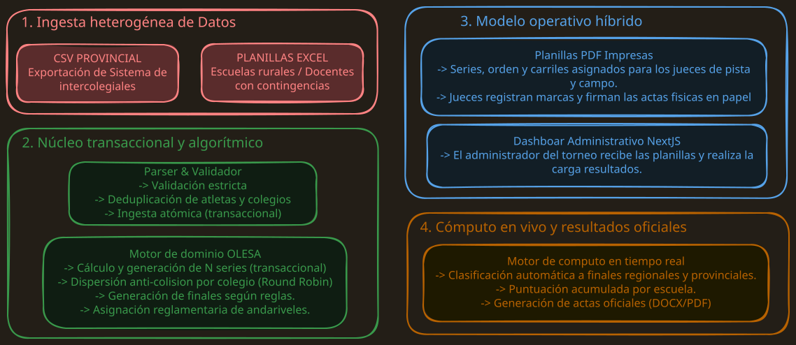

<!-- ================================================================= -->
<!-- ASSET 1: LOGO OFICIAL DE LAS OLIMPÍADAS                           -->
<!-- Procesado y optimizado por el servicio de imágenes de Astro       -->
<!-- ================================================================= -->

  Sports Secretariat — Government of the Province of San Luis

## 1. What this is about

Some problems have always existed and nobody fixes them because "that's just how it's always been done." This was one of them. I built a full athletics management and scoring system for the Community Sports Division of the San Luis Sports Secretariat, automating the entire lifecycle of the **School Athletics Olympics (OLESA)**: from consolidating registrations coming in from a dozen different sources, all the way to heat draws and final school point tallies. The concrete result: **the competition went from taking 3 days down to a single 8-hour day**, handling over **5,000 students from 100+ schools** across the 2024 and 2025 editions.

---

## 2. The problem: a bottleneck that tripled everything

Organizing school athletics at a provincial level involves three age categories (U14, U16, and U20) spread across regional rounds and a provincial final. Sounds manageable on paper. In practice, it was an operational disaster.

### How it worked before
* **A full day lost before a single race:** The tournament administrator spent an entire day manually transcribing registrations from scattered sources, checking rule constraints, and putting together judge score sheets by hand — all before any athlete ever set foot on the track.
* **The tournament was split across 3 days purely out of logistical slowness:** Manual calculation of times, standings, and school points was so slow that the tournament had to be split by category (one day per category). That meant tripling public spending on delegation transport, meals, and lodging. Money wasted on a problem that had a clear solution.
* **Two registration realities that didn't talk to each other:** There was the provincial web system ("Juegos Intercolegiales") that exported CSVs, and then there were Excel spreadsheets sent over WhatsApp or email — used by rural schools with no internet access, or by teachers who for whatever reason hadn't been able to register through the official platform. Someone had to manually reconcile that mess.

---

## 3. Key engineering decisions

  <!-- Tarjeta 1 -->
  

    

      
        01
      
      <h3 class="font-display text-base sm:text-lg font-bold text-fg-primary-light dark:text-fg-primary-dark">
        Atomic transactional bulk ingestion (<code class="font-mono text-xs bg-black/5 dark:bg-white/10 px-1 py-0.5">@Transactional</code>)
      </h3>
    

    

      

        
          Why I did it this way
        
        

          Every row in the file (CSV or Excel) needed an <em>upsert</em> flow: look up or create the athlete, link them to their school, and register the event while checking regulatory caps. If anything broke halfway through, there couldn't be a half-written registration sitting in the database. The entire load runs as a single transactional unit in MySQL: either everything goes in, or nothing does.
        

      

      

        
          Discarded Alternative & Trade-off
        
        

          <strong>Client-side processing or standalone scripts:</strong> Ruled out. Without referential integrity, any dropped connection or malformed input would leave the database in an unpredictable state.
        

      

    

  

  <!-- Tarjeta 2 -->
  

    

      
        02
      
      <h3 class="font-display text-base sm:text-lg font-bold text-fg-primary-light dark:text-fg-primary-dark">
        Deterministic algorithmic engine for heats and lane assignments
      </h3>
    

    

      

        
          Why I did it this way
        
        

          I wrote a custom backend algorithm: it computes <code>N = ceil(athletes / lanes)</code>, groups by school, and distributes heats using a reverse <em>round-robin</em> (<code>H1, H2, ..., Hn</code>) to guarantee that athletes from the same school never compete in the same heat. For finals, lane assignments follow the official World Athletics standard (lanes <code>4, 5, 3, 6, 2, 7, 1, 8</code> based on best times). There's no way this goes wrong because someone forgot something.
        

      

      

        
          Discarded Alternative & Trade-off
        
        

          <strong>Random draw or manual-assisted assignment:</strong> Ruled out. It introduces human bias and delays the start of track events — which was exactly the problem we were trying to solve.
        

      

    

  

  <!-- Tarjeta 3 -->
  

    

      
        03
      
      <h3 class="font-display text-base sm:text-lg font-bold text-fg-primary-light dark:text-fg-primary-dark">
        Document decoupling: structured JSON + client-side rendering
      </h3>
    

    

      

        
          Why I did it this way
        
        

          I kept the Spring Boot backend focused exclusively on what it's supposed to do: business logic, validation, and ACID persistence. Document generation — official score sheets as PDFs (<code>@react-pdf/renderer</code>) and final records as Word files (<code>docx</code>) — was delegated to the Next.js client. The server doesn't need to know what a document looks like; it just needs to know what data goes in it.
        

      

      

        
          Discarded Alternative & Trade-off
        
        

          <strong>Server-side document generation (JasperReports / heavy Apache POI):</strong> Ruled out to avoid hammering the VPS's RAM and CPU during concurrent downloads at peak traffic — right when the competition is running.
        

      

    

  

---

## 4. System Architecture

I designed the system as a decoupled backend in **Java / Spring Boot** with **MySQL** persistence, consumed by an admin SPA in **Next.js**, all packaged with **Docker Compose** on a Linux VPS (Ubuntu). The context had clear constraints: public sector, tight budget, no bandwidth for managing complex infrastructure. The architecture had to be easy to maintain and cheap to run.

### Data flow and tournament pipeline

  Figure 1: Functional architecture of the OLESA pipeline (bulk ingestion, algorithmic processing, hybrid operation, and scoring).

#### The full flow in 4 stages:
1. **Heterogeneous ingestion:** Consolidating inputs from CSVs (provincial system) and Excel spreadsheets (rural schools and teachers who couldn't register through the web platform).
2. **Transactional and algorithmic core (Spring Boot):** Atomic data cleaning and deduplication (`@Transactional`), followed by the domain engine that distributes heats using round-robin (school collision prevention) and assigns lanes.
3. **Hybrid operational model (offline resilience):** Auto-generated printed PDF score sheets for field judges — zero network dependency on the track — and supervised data entry from the control desk via the Next.js SPA.
4. **Live scoring and results:** Automatic qualification to the provincial finals, school point accumulation, and immediate generation of official records (DOCX/PDF).

---

### Domain modeling: polymorphic events and track types

To accurately reflect athletic rules without tying the system to any specific track, I structured the domain with a polymorphic hierarchy that decouples the discipline from the physical infrastructure. There are three event types with fundamentally different behaviors:

* **Lane-based track events (Sprints — 80m, 100m):** Require algorithmic heat partitioning, regulatory lane assignment based on the host track's capacity (6, 8, or 10 lanes), and time-based qualification to finals.
* **Lane-free track events (Middle and long distance):** Start as a single group or staggered in a free lane, with no strict individual lane restrictions.
* **Field events (Shot put, Long jump):** No lanes involved; operate with successive rounds of attempts (valid or null marks) where the final ranking is determined by each athlete's best recorded mark.

This domain-driven design (DDD) allowed me to reuse the same scoring engine across different provincial venues with 6- or 8-lane tracks without touching the business logic or the database schema.

---

## 5. The challenge that made me think the hardest

### No internet on the track vs. centralized scoring

This was the most interesting trade-off in the entire project. The athletics track has no mobile signal. Full stop. No way around it.

* **The dilemma:** Field judges had zero or unreliable connectivity, so running a concurrent web app on the track was simply not an option.
* **How I solved it:** I adopted a **hybrid digital-physical model**. The system automatically generates and prints blank official field score sheets, already filled with the drawn heats and lane assignments. Judges record times and signatures on paper — which also keeps the official regulatory backup — and a centralized control desk enters the data into the system in real time.
* **Trade-off accepted:** I accepted a manual data entry step at the control desk in exchange for **zero network dependency on the track and full regulatory and legal validity** of the signed records. In this context, that's exactly the right trade.

---

## 6. Results: the numbers

* **From 1 day down to under 1 hour:** Registration ingestion and validation, heat assignment, and score sheet generation went from a full day of manual work to under 60 minutes.
* **From 3 days to a single day:** All three categories (U14, U16, and U20) competed in one 8-hour day. No delays in heat setup or qualification to finals.
* **Direct logistical impact:** Dramatic reduction in provincial spending on school delegation transport, meals, and lodging. That's real public money no longer being wasted.
* **Production scale:** Handled over **5,000 students from 100+ schools** across the official 2024 and 2025 editions.
* **Automated finals:** Automatic qualification of the top 2 athletes from each region to form the 16 provincial finalists, plus automatic point allocation to the top 8 finishers for school rankings.

---

## 7. What I'd do differently today

If I were redesigning the solution today, I'd implement an **Offline-First architecture (PWA with background sync via CRDTs or IndexedDB)** for the field judge desks. That would let judges record attempts and nulls directly on tablets without connectivity, syncing automatically with the central desk as soon as they get a signal — eliminating the intermediate manual transcription step entirely.
