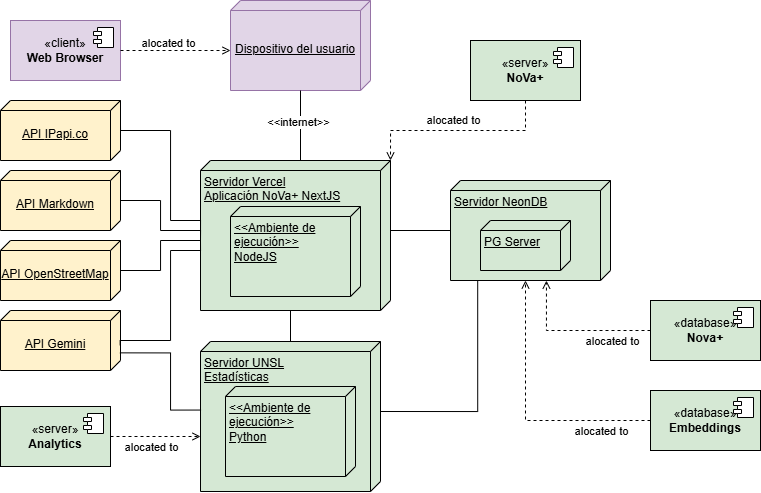
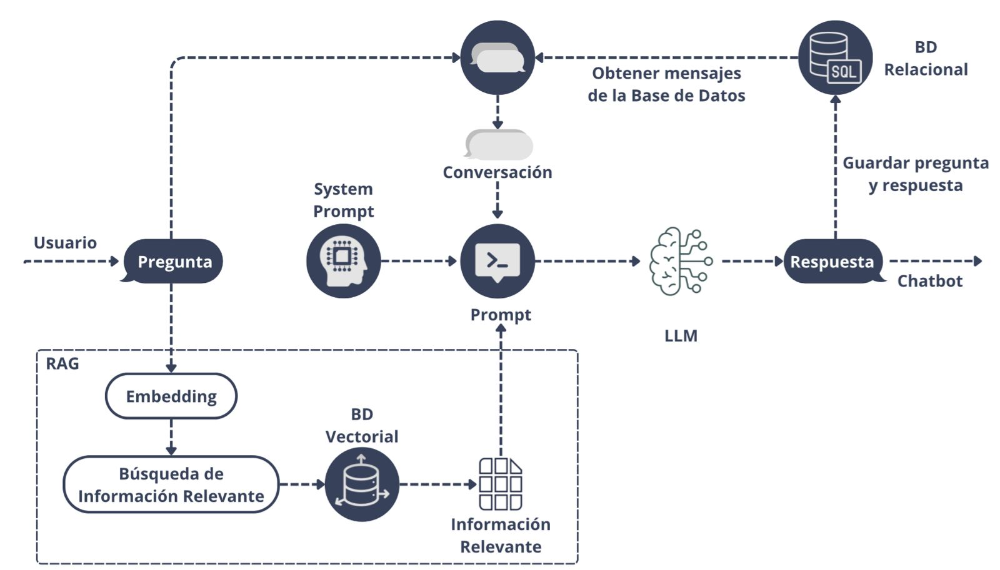

## 1. Resumen Ejecutivo

Sistema conversacional inteligente con arquitectura RAG desarrollado como **Trabajo Final de Carrera (Proyecto Integrador) de Ingeniería en Informática** en la Universidad Nacional de San Luis (UNSL), calificado con **10 (diez)**. Diseñado en conjunto con investigadores de la Facultad de Psicología para el *Programa Universitario de Prevención de Consumos Problemáticos y Conductas Adictivas*, proporciona un canal confidencial, empático y psicoeducativo para la detección temprana de conductas de riesgo frente a la ludopatía digital en adolescentes, validado en pruebas de campo con más de 50 usuarios concurrentes simultáneos.

---

## 2. El Problema: Adicción Digital y la Barrera del Estigma

El crecimiento explosivo de billeteras virtuales, casinos en línea y plataformas de apuestas deportivas generó una crisis emergente de ludopatía y endeudamiento temprano en estudiantes de escuelas secundarias y universidades.

### Limitaciones y fricciones del escenario previo
* **Inaccesibilidad y estigma institucional:** Los canales tradicionales de contención (charlas presenciales o líneas telefónicas de adicciones) sufren un elevado rechazo juvenil por miedo a la sanción escolar, la pérdida de privacidad o el juicio familiar.
* **Sesgos cognitivos desatendidos:** Los jóvenes caen en falsedades lógicas reforzadas por la gamificación de las apuestas virtuales (como la *ilusión de control* o la *falacia del apostador*), careciendo de herramientas interactivas que desmitifiquen las probabilidades matemáticas en su propio lenguaje.
* **Falta de instrumentos para investigación psicológica:** El equipo de salud mental no disponía de un método estandarizado para recopilar métricas empíricas de campo (patrones de diálogo, indicadores emocionales y niveles de riesgo) sin vulnerar el anonimato ni las directrices éticas de la Agencia de Acceso a la Información Pública (AAIP).

---

## 3. Decisiones Clave de Ingeniería

  <!-- Tarjeta 1 -->
  

    

      
        01
      
      <h3 class="font-display text-base sm:text-lg font-bold text-fg-primary-light dark:text-fg-primary-dark">
        Arquitectura distribuida desacoplada: Next.js (Vercel) + Servidor Python dedicado (UNSL)
      </h3>
    

    

      

        
          ✓ Justificación
        
        

          El asistente conversacional requiere latencia mínima y streaming fluido para retener la atención de jóvenes en móvil. El análisis de texto mediante Transformers (<code class="font-mono text-xs bg-black/5 dark:bg-white/10 px-1 py-0.5">pysentimiento</code>, detección de emociones, ironía y exportación analítica a Excel) demanda alto cómputo de CPU. Separar ambos servicios previene que los cálculos pesados bloqueen el event loop web o encarezcan el consumo serverless.
        

      

      

        
          ✕ Alternativa Descartada
        
        

          <strong>Monolito en Python (FastAPI/Streamlit) o procesamiento unificado en Next.js:</strong> Descartado por el riesgo de degradación de latencia en el chat durante picos de cálculo estadístico concurrente.
        

      

    

  

  <!-- Tarjeta 2 -->
  

    

      
        02
      
      <h3 class="font-display text-base sm:text-lg font-bold text-fg-primary-light dark:text-fg-primary-dark">
        Selección de Gemini 2.5 Flash con razonamiento nativo
      </h3>
    

    

      

        
          ✓ Justificación
        
        

          Conforme a los benchmarks independientes de <em>Artificial Analysis</em> (agosto 2025), el modelo se situó en el cuadrante óptimo de equilibrio: máxima velocidad de salida (tokens/segundo) para mantener la inmediatez del diálogo, índice de inteligencia de 58 puntos con razonamiento integrado para acatar directrices clínicas, y un costo operativo viable para la universidad pública.
        

      

      

        
          ✕ Alternativa Descartada
        
        

          <strong>Modelos locales (Llama 3 / Mistral) o LLMs frontera pesados (GPT-4o / Claude Opus):</strong> La ejecución local requería servidores con hardware GPU prohibitivo para 50+ concurrentes; los modelos frontera encarecían los tokens sin aportar valor diferencial en diálogos breves de orientación.
        

      

    

  

  <!-- Tarjeta 3 -->
  

    

      
        03
      
      <h3 class="font-display text-base sm:text-lg font-bold text-fg-primary-light dark:text-fg-primary-dark">
        Normalización a Markdown previa al chunking semántico (600 car. + solapamiento)
      </h3>
    

    

      

        
          ✓ Justificación
        
        

          Los manuales de psicología y guías clínicas en PDF poseen estructuras complejas (doble columna, tablas, pies de página) que distorsionan el vectorizado si se ingieren en crudo. Convertir previamente a Markdown conserva la semántica del documento, y el corte en oraciones naturales con solapamiento evita fracturar conceptos clínicos clave.
        

      

      

        
          ✕ Alternativa Descartada
        
        

          <strong>Ingesta directa de texto plano de PDFs o chunking rígido por tamaño fijo:</strong> Descartado por generar falsos positivos semánticos y alucinaciones al partir definiciones a la mitad.
        

      

    

  

  <!-- Tarjeta 4 -->
  

    

      
        04
      
      <h3 class="font-display text-base sm:text-lg font-bold text-fg-primary-light dark:text-fg-primary-dark">
        Privacidad por diseño (AAIP) y cifrado en reposo (AES-256-GCM)
      </h3>
    

    

      

        
          ✓ Justificación
        
        

          Bajo la Ley 25.326 y recomendaciones de la AAIP para IA responsable, el sistema opera con acceso público anónimo (sin registro) y credenciales temporales efímeras para intervenciones escolares. Toda la persistencia de mensajes y métricas se cifra en reposo mediante AES-256-GCM con claves segregadas.
        

      

      

        
          ✕ Alternativa Descartada
        
        

          <strong>Almacenamiento en texto plano o autenticación obligatoria con correo/DNI:</strong> Descartado para cumplir con el principio de minimización de datos y evitar desconfianza en menores al relatar situaciones personales de juego.
        

      

    

  

---

## 4. Arquitectura del Sistema

El sistema opera bajo una topología distribuida multi-nodo: una aplicación web serverless en **Next.js** desplegada sobre el edge de **Vercel** que gestiona la interfaz interactiva y el streaming de mensajes mediante el **Vercel AI SDK**, enlazada a una base de datos **PostgreSQL con extensión pgvector en NeonDB** ubicada en la misma región geográfica para asegurar tiempos de ida y vuelta mínimos. Un servidor backend on-premise en **Python**, alojado en la infraestructura física de la UNSL, se encarga del procesamiento analítico en segundo plano.

### Infraestructura y Despliegue Físico

  

  

  
    Figura 1: Diagrama de Despliegue de la infraestructura (Next.js en Vercel, servidor Python on-premise en UNSL, PostgreSQL/pgvector en NeonDB y APIs externas).
  

---

### Pipeline de Inferencia RAG y Flujo de Datos

  

  

  
    Figura 2: Flujo de datos del asistente conversacional (Ingesta, recuperación semántica vectorial, inyección de directrices éticas y generación en tiempo real).
  

#### Desglose del ciclo de interacción en 4 fases:
1. **Ingesta y segmentación documental:** Conversión de literatura clínica a Markdown, particionado adaptativo en chunks de 600 caracteres con solapamiento y generación de embeddings vectoriales.
2. **Recuperación contextual (Retrieval):** Búsqueda de vecinos más cercanos mediante pgvector para recuperar los fragmentos documentales con mayor similitud semántica respecto a la consulta del estudiante.
3. **Inyección de guardrails y generación asistida:** Construcción del prompt unificado (System Prompt ético + Historial de conversación + Formulario inicial previo + Chunks bibliográficos) y generación de respuesta en streaming vía Gemini 2.5 Flash.
4. **Análisis NLP asíncrono y auditoría:** Cifrado simétrico AES-256-GCM para almacenamiento seguro en NeonDB y evaluación en el servidor Python con `pysentimiento` para clasificar polaridad, emociones e indicadores de riesgo para los investigadores.

---

## 5. Desafío Técnico Central y Trade-offs

### Tensión: Empatía dialéctica con LLMs vs. Regla innegociable de "No Diagnóstico Clínico"

* **El dilema:** Los modelos de lenguaje tienden naturalmente a agradar al interlocutor y generar afirmaciones taxativas ("presentas un cuadro de ludopatía moderada"), lo que representaba un riesgo ético crítico para un sistema que atiende a población adolescente en salud mental.
* **La resolución pragmática:** Se diseñó una **arquitectura de ingeniería de contexto con guardrails estrictos** en el System Prompt. El asistente tiene bloqueada cualquier emisión de juicios diagnósticos o prescripciones; su rol se circunscribe a la escucha activa sin estigma, la clarificación de falacias de probabilidad matemática y la derivación asistida a redes de contención y centros de salud oficiales (integrando geolocalización de dependencias en San Luis).
* **Trade-off asumido:** Se priorizó el **rigor ético y la seguridad clínica** por sobre la libertad expresiva del modelo, delimitando las fronteras de respuesta pero garantizando un entorno confiable y respaldado por especialistas en psicología.

---

## 6. Resultados e Impacto Cuantitativo

* **Calificación perfecta:** Aprobado 10/10 y calificación máxima por el tribunal evaluador de la UNSL.
* **Validación bajo estrés (50+ usuarios concurrentes):** Soportó pruebas simultáneas en aulas escolares y comisiones universitarias, procesando a **92 visitantes, 125 sesiones y más de 2.300 mensajes** sin experimentar caídas ni degradación de latencia.
* **Rendimiento web medido (Vercel Speed Insights):**
  * **Real Experience Score (RES):** 97 sobre 100 puntos.
  * **First Input Delay (FID):** 3 ms promedio (98% calificado como excelente).
  * **Time to First Byte (TTFB):** 0.23 segundos promedio (96% calificado como excelente).
  * **Interaction to Next Paint (INP):** 96 ms promedio (92% calificado como excelente).
* **Fidelidad y uso del RAG:** El **95%** de las respuestas generadas por el asistente integraron de forma explícita el contenido recuperado de la base de conocimiento bibliográfica.
* **Aceptación y usabilidad:** Calificación media de **4.8/5 estrellas** en el feedback conceptual y **4.4/5** en la escala de Likert sobre la utilidad percibida de la herramienta.
* **Transferencia científica:** Publicación y exposición de papers y pósteres en el **13.º Congreso Nacional de Ingeniería Informática (CoNaIISI 2025, Córdoba)**, el **Congreso de Salud Mental (Mendoza 2025)** y las **3.as Jornadas Universitarias de Salud y Consumos Problemáticos (UNSL)**.

---

## 7. Qué Haría Distinto Hoy

Si rediseñara la solución hoy, incorporaría un **pipeline de evaluación continua automatizada de RAG mediante frameworks como Ragas o TruLens**, calculando métricas de *faithfulness*, *context recall* y *answer relevancy* de forma desatendida en cada actualización de contenido. Asimismo, implementaría un **canal alternativo vía WhatsApp Cloud API o una Progressive Web App (PWA) con sincronización offline**, permitiendo derribar la barrera de conectividad para adolescentes de escuelas rurales o con planes de datos móviles restringidos.
